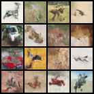

# Denoising Diffusion Probabalistic Models

A PyTorch implementation of the original DDPM, with a focus on improving training efficiency.


> DDPM trained on CIFAR10

## Setup

Install PyTorch with version 2+ and FFCV.  
To install FFCV without using Conda:

```
sudo apt install libopencv-dev libturbojpeg-dev
pip install -r requirements.txt
```


## Performance Optimizations

### How Performance is Measured

We measure time and floating point operations.  
Time is measured with `torch.cuda.Event`. We measure the time elapsed for 1 iteration (forward, backward, weight update).  
We estimate the number of FLOPs for the forward pass using `torchinfo.summary` and multiply by 3 to get the forward and backward pass.  
Our target GPU A100 has 19.5 TFLOP/s of FP32 compute, 312 TFLOP/s of FP16 compute, and 1.555 TB/s of memory bandwidth.

- [A100 Specifications](https://www.nvidia.com/content/dam/en-zz/Solutions/Data-Center/a100/pdf/nvidia-a100-datasheet-us-nvidia-1758950-r4-web.pdf)
- [PyTorch Profiler](https://pytorch.org/tutorials/recipes/recipes/profiler_recipe.html)
- [Using CUDA events to measure time](https://discuss.pytorch.org/t/how-to-measure-time-in-pytorch/26964/2)


### Optimization Techniques

| Version | TFLOPs per Second | Speedup | MFU (%)
| :- | :-: | :-: | :-: |
| Baseline | 2.096 | 1.00x | 10.75 |
| Scale Up Batch Size | 2.404 | 1.15x | 12.33 |
| `torch.compile` | 3.24 | 1.54x | 16.62 |
| Use PyTorch SDPA | 6.06 | 2.89x | 31.08 |
| Mixed-Precision Training | 16.47 | 7.86x | 5.28 |
| Use FFCV for Data Loading | 16.70 | 7.97x | 5.35 |

#### Scale Up Batch Size

We scale up the batch size to 320, the maximum batch size the GPU can hold.

### Use PyTorch SDPA

Using Flash Attention, we significantly lower our memory usage, which allow us to scale the batch size to 2048.

- [PyTorch SDPA doc](https://pytorch.org/docs/stable/generated/torch.nn.functional.scaled_dot_product_attention.html)
- [NanoGPT Usage](https://github.com/karpathy/nanoGPT/blob/master/model.py)

### Mixed-Precision Training

Lowering to 16-bit precision lowers the memory requirements, so we further increase the batch size to 3072.  
Although the performance increased by 4x, the GPU has a lot more FP16 compute, so the MFU decreases.

- [Tutorial 1](https://pytorch.org/blog/what-every-user-should-know-about-mixed-precision-training-in-pytorch/)
- [Tutorial 2](https://pytorch.org/blog/accelerating-training-on-nvidia-gpus-with-pytorch-automatic-mixed-precision/)

### Use FFCV for Data Loading

- [FFCV GitHub Repo](https://github.com/libffcv/ffcv)
- [MosaicML Example Notebook](https://colab.research.google.com/github/mosaicml/composer/blob/75dabff3f5715f02bfc32cc23c557ba4042c462d/examples/ffcv_dataloaders.ipynb)
- [FFCV API Reference](https://docs.ffcv.io/api_reference.html)


## Future Works

Future works include optimizing diffusion models for inference and implmenting custom kernels.


## References

- [The Annotated Diffusion Model](https://huggingface.co/blog/annotated-diffusion)
- [cloneofsimo/minDiffusion](https://github.com/cloneofsimo/minDiffusion/tree/master)
- [lucidrains/denoising-diffusion-pytorch](https://github.com/lucidrains/denoising-diffusion-pytorch/tree/main)
- [Paper: Denoising Diffusion Probabilistic Models](https://arxiv.org/abs/2006.11239)
- [Inference Optimization of Diffusion Policy](https://www.vrushankdes.ai/diffusion-inference-optimization)